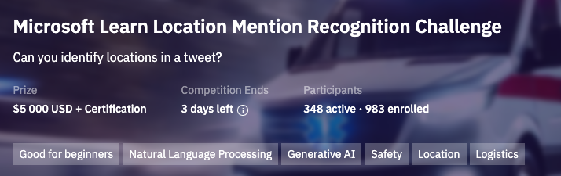
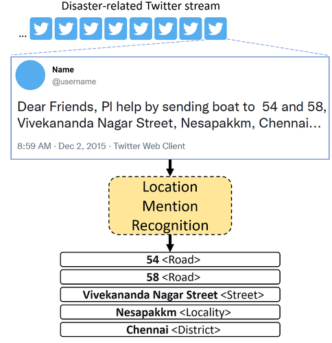
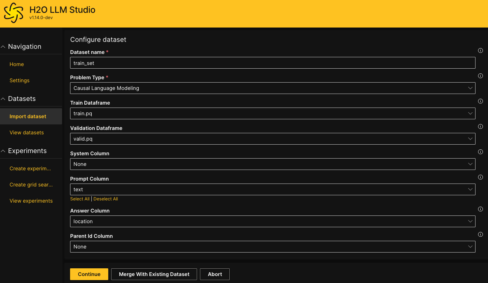
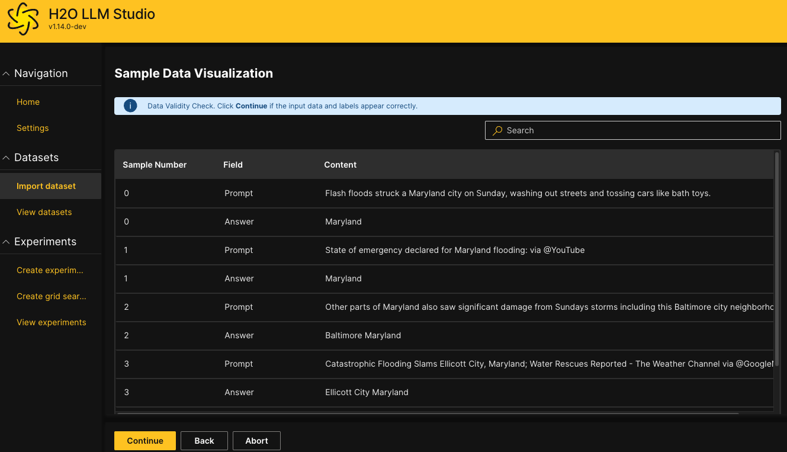
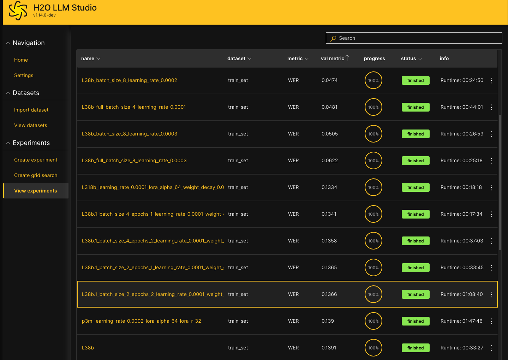

# Location Mention Recognition with H2O LLM Studio


## Competition Goal



The objective of the Microsoft Learn Location Mention Recognition Challenge was to encourage the development of systems for Location Mention Recognition (LMR) from microblogging posts during emergencies. These automatic systems are anticipated to support the relief activities that are executed by the response authorities during disasters.



Given a microblogging post, the task was to recognize all location mentions.


## Intro
A big thanks to Microsoft and Zindi for hosting the challenge and to Reem Suwaileh for curating the IDRISI annotated dataset. I’ve been following the competition from the start, as it offered a great opportunity to apply and benchmark fine-tuning large language models.

The initial design of the competition, the selected Word Error Rate (WER) evaluation metric and focusing on the Location Mention Recognition sub-task all favored traditional token classification approaches with postprocessing techniques.

Fortunately, I was curious to build a straightforward LLM fine-tuning solution.  Throughout the competition, the training dataset had several changes, and I believe the most recent rule updates now prevent the use of token-level labels from the original JSON files.

## H2O LLM Studio


H2O LLM Studio is a framework and no-code GUI designed for fine-tuning state-of-the-art large language models.

With H2O LLM Studio, you can
* easily and effectively fine-tune LLMs without the need for any coding experience.
* use a graphic user interface (GUI) specially designed for large language models.
* finetune any LLM using a large variety of hyperparameters.
* use recent finetuning techniques such as Low-Rank Adaptation (LoRA) and 8-bit model training with a low memory footprint.
* track and compare your model performance visually. In addition, Neptune and W&B integration can be used.
* easily export your model to the Hugging Face Hub and share it with the community.

## Data Preparation
According to the latest rules only the provided train CSV was used for model training. The dataset had quite a few missing values with empty tweets and locations. All records with missing values were dropped.
For train-validation split 80-20% random sample was used.

I had some experiments with text cleaning or fixing the labels, but ultimately, the dataset remained unchanged. I suspect that the test set contained similar inconsistencies and label noise as the training set.


Importing the [prepared dataset](https://drive.google.com/file/d/1yD8vhZPRert9g37_BBdSvn2YF4RZ0nnr/view?usp=drive_link) into H2O LLMStudio is easy.
Just select the tweet `text`as the prompt column and `location` as the answer column. We will try to finetune the base models to recognize all the mentioned locations in the tweet.



## Experiments

There are lots of possible settings in H2O LLM Studio, the default settings are generally good to start experimenting.

Initially I started with Small Language Models [H2O Danube2-1.8B](https://huggingface.co/h2oai/h2o-danube2-1.8b-base) and [H2O Danube3-4B](https://huggingface.co/h2oai/h2o-danube3-4b-base).
With H2O Danube3-4B it was possible to reach 0.132 on the Public Leaderboard.

Utilizing larger models resulted in slight improvements both on my validation set and the public leaderboard, achieving WER between 0.118 and 0.121.

Upon reviewing the validation set errors, I noticed that the models performed well. In fact, I would have accepted the model's predictions over the original ground truth labels in many cases.



### Best settings
* **LLM Backbone**:  [meta-llama/Meta-Llama-3-8B](https://huggingface.co/meta-llama/Meta-Llama-3-8B)
* **Backbone Dtype**: int4 -> bfloat16
* **Epochs**: 1 -> 2
* **Warmup Epochs**: 0.0 -> 0.1
* **Lora R**: 4 -> 16
* **Lora Alpha**: 16 -> 64
* **Metric**: WER
* **Min Length Inference**: 2 -> 1
* **Max Length Inference**: 256 -> 99


## Required Resources
Running inference with the selected models is easy on NVIDIA T4 GPUs.
See this [kaggle notebook](https://www.kaggle.com/code/gaborfodor/loc-rec-mention-h2o-llmstudio) as an example.
For development and model fine-tuning, I would recommend newer and faster GPUs.

Fortunately, the tweets are short, and H2O LLM Studio offers several built-in optimization techniques (Gradient Checkpointing, Low-Rank Adaptation, bfloat, etc.) to enable effective model finetuning. In fact, training my best models with 8B parameters on a single NVIDIA L40S GPU took less than an hour.

The rental cost for an L40S was $1.1 per hour, so the total development process—including installation, data upload, fine-tuning, and test set inference—would cost less than $2. In comparison, renting a `g4dn.2xlarge` on AWS with a single Nvidia T4 GPU costs $0.72 per hour. However, since it is significantly slower, the overall cost would end up being higher despite the lower hourly rate.

The finished experiment can be exported to [Hugging Face Hub](https://huggingface.co/) with a single click, making it immediately ready to use in inference.


## Install H2O LLM Studio and start your own fine-tuning
H2O LLM Studio is an open-source project, making it easy to modify and extend with new features. Since the competition used WER for evaluation, I added it as a validation metric. 
Select the `locrec` branch from my [fork](https://github.com/gaborfodor/h2o-llmstudio/tree/locrec).


To install H2O LLM Studio you can follow the default instructions:
```
# create conda env
conda create -n llmstudio python=3.10
conda activate llmstudio
conda install -c "nvidia/label/cuda-12.1.0" cuda-toolkit`
make setup

# add an additional package for WER calculation
make shell
pip install jiwer

# start H2O LLM Studio
make llmstudio
```
This command will start the H2O wave server and app. Navigate to http://localhost:10101/ to access H2O LLM Studio and start fine-tuning your models!
